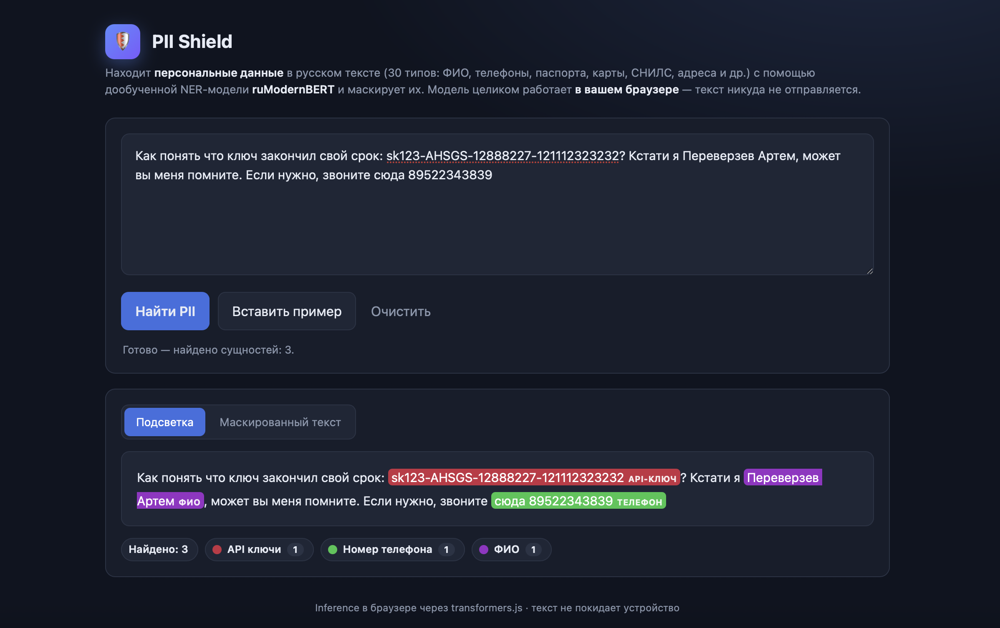

# 🛡️ PII Shield

**Находит и прячет персональные данные в русском тексте.**

Вставляете текст — приложение подсвечивает всё личное (ФИО, телефоны, паспорта, банковские
карты, СНИЛС, адреса и т.д.) и одной кнопкой заменяет это на безопасные метки вроде
`[ТЕЛЕФОН]` или `[ФИО]`. Удобно, когда нужно поделиться текстом, перепиской или документом,
не раскрывая чужие данные.

## Как пользоваться

1. Откройте сайт: **https://astifer.github.io/pii-shield/**
2. Вставьте свой текст в поле (или нажмите **«Вставить пример»**, чтобы попробовать).
3. Нажмите **«Найти PII»** — все персональные данные подсветятся цветом.
4. Чтобы их скрыть, переключитесь на вкладку **«Маскированный текст»** и нажмите
   **«Копировать»** — получите очищенный текст, готовый к отправке.

> При самом первом запуске приложение один раз скачивает модель (~150 МБ) — это занимает
> несколько секунд. Дальше всё работает быстро.

## Пример

**Было:**
> Меня зовут Иванова Мария, телефон +7 916 555-21-43, почта maria@example.com.

**Стало:**
> Меня зовут [ФИО], телефон [ТЕЛЕФОН], почта [EMAIL].



## Это безопасно?

**Да.** Текст никуда не отправляется. Модель работает прямо в вашем браузере, на вашем
устройстве — ничего не уходит на сервер и нигде не сохраняется.

## Что приложение умеет находить

Всего 30 видов личных данных, в том числе:

- **Личность:** ФИО, дата и место рождения, гражданство
- **Контакты:** телефон, email, полный адрес, адрес регистрации
- **Документы:** паспорт, СНИЛС, ИНН, водительское удостоверение, ВНЖ, виза,
  свидетельство о рождении
- **Банк и карты:** номер карты, срок действия, CVV, имя держателя, номер счёта,
  название банка
- **Секреты:** пароли, ПИН-коды, одноразовые коды, API-ключи, кодовые слова
- **Организации и авто:** данные о компании, данные об автомобиле

## Что-то не работает?

- Если после нажатия «Найти PII» появляется ошибка загрузки модели — обновите страницу,
  возможно, модель ещё докачивается.
- Нужен современный браузер (Chrome, Edge, Firefox, Safari) и интернет для **первой**
  загрузки модели.
- Модель не идеальна: иногда может пропустить редкое имя или захватить лишнее слово.
  Перед отправкой важного текста перепроверьте результат глазами.

---

<details>
<summary><b>Для разработчиков</b> (как это устроено, запуск локально, обучение)</summary>

Под капотом — дообученная NER-модель **ruModernBERT** (30 типов PII, BIO-разметка, 61 метка).
На сайте она запускается прямо в браузере через
[transformers.js](https://github.com/huggingface/transformers.js): статика лежит на GitHub
Pages (`docs/`), ONNX-веса — на Hugging Face Hub (`astifer/pii-shield-onnx`).

### Запустить локально (Python-сервер)

```bash
unzip ner_model_final.zip          # -> ./ner_model_final/
python server.py --preload         # откройте http://127.0.0.1:8000
```

| Файл | Назначение |
|---|---|
| `server.py` | HTTP-сервер на стандартной библиотеке (отдаёт UI и `POST /api/detect`) |
| `infer.py` | Загрузка модели + инференс (BIO-декодинг, чистка спанов, маскирование) |
| `static/index.html` | Локальный фронтенд (общается с сервером) |
| `docs/index.html` | Браузерный фронтенд для GitHub Pages (transformers.js + ONNX) |
| `convert_to_onnx.py` | Конвертация модели в ONNX для браузера |
| `train.py` / `postprocessing.py` | Обучение и постобработка предсказаний |

### Выложить на GitHub Pages

```bash
# 1. Конвертация в ONNX (нужна сеть)
pip install "optimum[onnxruntime]>=1.24"
python convert_to_onnx.py          # -> ./web_model/

# 2. Загрузка весов на Hugging Face Hub (репозиторий public)
hf upload astifer/pii-shield-onnx ./web_model .

# 3. Запушить docs/ и включить Pages
git add docs && git commit -m "Deploy PII Shield to Pages" && git push
```

Затем в GitHub: **Settings → Pages → Deploy from a branch → `main` / `/docs`**.
`MODEL_ID` в `docs/index.html` уже указывает на `astifer/pii-shield-onnx`.
Версии: `optimum ≥ 1.24` (экспорт ModernBERT), `@huggingface/transformers` 3.x (с CDN).

### Обучение

```bash
pip install -r requirements.txt
python train.py                    # параметры — в TrainConfig внутри train.py
```

Заложенные практики: 5-fold CV с усреднением вероятностей, EMA весов (decay 0.995),
cosine-расписание с warmup, label smoothing 0.1, class-weighted loss, gradient checkpointing,
mixed precision, опциональный pseudo-labeling. Датасеты — в `data/`.

**Полный список 30 типов:** API ключи, CVV/CVC, Email, Водительское удостоверение, Временное
удостоверение личности, Гражданство и названия стран, Данные об автомобиле клиента, Данные об
организации/юридическом лице, Дата окончания срока действия карты, Дата регистрации по месту
жительства или пребывания, Дата рождения, Имя держателя карты, Кодовые слова, Место рождения,
Наименование банка, Номер банковского счета, Номер карты, Номер телефона, Одноразовые коды,
ПИН код, Пароли, Паспортные данные, Полный адрес, Разрешение на работу / визу, СНИЛС клиента,
Сведения об ИНН, Свидетельство о рождении, Серия и номер вида на жительство, Содержимое
магнитной полосы, ФИО.

</details>
